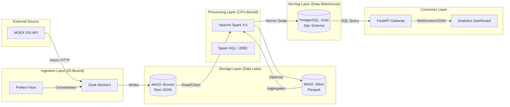

<div align="center" style="border: none; padding: 0; margin: 0;">
  <h1>📈 MOEX Enterprise Data Platform</h1>
  <strong>Industrial-grade Data Engineering Solution: A scalable End-to-End pipeline for Russian Stock Market analytics.</strong>
  <br>
  </br>
  <p align="center">
    
    
    
    
    
    
    
    
    
    
  </p>
  
  <h3>Real-time Analytics • Medallion Architecture • Atomic Updates</h3>
</div>

## 🚀 Обзор Проекта

Этот проект представляет собой **End-to-End платформу данных** уровня Enterprise для анализа торговой активности Московской Биржи (MOEX). Система реализует полный цикл обработки данных: от асинхронного сбора (Ingestion) до визуализации финансовых метрик, используя современные архитектурные паттерны Big Data.

Система построена на принципах **Clean Architecture** и **Medallion Architecture** (Bronze → Silver → Gold), обеспечивая надежность, масштабируемость и чистоту данных.

### Компоненты системы:

1.  **Ingestion Engine (Dask)**: Асинхронный параллельный сборщик данных. Использует распределенные вычисления для эффективной обработки тысяч HTTP-запросов к API биржи.
2.  **Processing Core (Apache Spark)**: Мощный движок трансформации. Отвечает за очистку данных, приведение типов и расчет сложных финансовых индикаторов (RSI, SMA) с использованием оконных функций.
3.  **Storage Layer (Data Lake & Warehouse)**: Гибридное хранилище. **MinIO (S3)** для сырых данных и **PostgreSQL** для витрин данных.
4.  **Orchestration (Prefect)**: Управление потоками данных, мониторинг задач и автоматический перезапуск при сбоях.
5.  **Analytics UI (Dash + FastAPI)**: Интерактивный веб-интерфейс для трейдеров и аналитиков с возможностью запуска пользовательского Python-кода (Sandbox).

---

## 🏗 Архитектура и Data Flow

Мы используем гибридный вычислительный подход: **Dask** для IO-bound задач (сеть) и **Spark** для CPU-bound задач (математика).



## ✨ Ключевые возможности

### 🤖 Intelligent Ingestion
*   **Smart Backfill**: Автоматическая загрузка исторических данных (глубина до 2010 года).
*   **Идемпотентность**: Система "знает", какие данные уже загружены, и пропускает их, экономя трафик и время.
*   **Parallel Fetching**: Использование `dask.delayed` позволяет утилизировать сетевой канал на 100%.

### 🧪 Advanced Analytics (Spark)
*   **Технический анализ**: Автоматический расчет RSI (Relative Strength Index) и SMA (Simple Moving Average) на кластере Spark.
*   **Schema Enforcement**: Строгая типизация данных при переходе из Bronze (JSON) в Silver (Parquet).
*   **Parquet Optimization**: Данные хранятся в колоночном формате с Snappy сжатием для ускорения чтения.

### 🛡️ Enterprise Engineering
*   **Atomic Data Swaps**: Обновление данных в PostgreSQL происходит через транзакционный механизм (Staging Table -> Delete Old -> Insert New -> Drop Staging). Это гарантирует **Zero Downtime** — пользователь никогда не увидит пустые графики во время ETL процесса.
*   **RBAC Security**: Ролевая модель доступа (Admin/User). Только администраторы могут запускать тяжелые ETL-процессы.
*   **Docker Isolation**: Каждый сервис (даже Spark Master/Worker) работает в изолированном контейнере.

### 📊 Visualization & Sandbox
*   **Интерактивные графики**: Candlestick charts, Volume bars, RSI indicators.
*   **Python Sandbox**: Встроенная "песочница", позволяющая аналитикам писать свой код на Python прямо в браузере для анализа загруженных данных (pandas/numpy/plotly).

---

## 🛠️ Технический стек

| Категория | Технологии | Назначение |
| :--- | :--- | :--- |
| **Compute** |   | Распределенная обработка данных |
| **Storage** |   | Объектное хранилище и реляционная БД |
| **Backend** |   | REST API и валидация конфигурации |
| **Frontend** |   | UI/UX |
| **Ops** |   | Контейнеризация и оркестрация |

---

## ⚙️ Установка и Запуск

Проект полностью контейнеризирован. Вам потребуется только **Docker** и **Docker Compose**.

### 1. Клонирование репозитория
```bash
git clone https://github.com/your-username/moex-data-platform.git
cd moex-data-platform
```

### 2. Настройка окружения
Проект уже содержит файл `.env` с настройками по умолчанию для локальной разработки.
*(Опционально)* Отредактируйте `.env`, если конфликтуют порты.

### 3. Запуск (Build & Run)
Сборка кастомного образа Spark (включает Java 17 и все JAR-зависимости) и запуск сервисов:

```bash
docker-compose up -d --build
```
> ⏳ **Примечание:** Первый запуск может занять 5-10 минут, так как происходит скачивание дистрибутива Spark и компиляция базового образа.

### 4. Доступ к интерфейсам

| Сервис | URL | Описание | Креды (если есть) |
| :--- | :--- | :--- | :--- |
| **Dashboard** | `http://localhost:8050` | Основной UI аналитики | `admin` / `admin` |
| **API Docs** | `http://localhost:8000/docs` | Swagger UI | - |
| **Prefect UI** | `http://localhost:4200` | Оркестратор задач | - |
| **MinIO** | `http://localhost:9001` | S3 Браузер | `minioadmin` / `minioadmin` |
| **Spark Master** | `http://localhost:8080` | Состояние кластера | - |

---

## 📚 Сценарии использования (User Guide)

### 1. Инициализация системы
При первом старте база данных пуста. Скрипт миграции запустится автоматически, но вы можете сбросить состояние вручную:
```bash
docker exec -it moex_etl_runner python src/create_tables.py
```

### 2. Запуск пайплайна (ETL)
1.  Откройте **Dashboard** (`localhost:8050`) и войдите как `admin`.
2.  В панели **Data Ingestion** введите тикер (например, `SBER`, `GAZP` или `IMOEX`).
3.  Нажмите **Queue Task**.
4.  Наблюдайте за прогрессом в реальном времени через виджет задач (WebSocket).

### 3. Анализ данных
1.  После завершения задачи (Status: `SUCCESS`), выберите тикер в выпадающем списке.
2.  Переключайтесь между **Daily** (дневки) и **Minute** (минутки).
3.  Перейдите в раздел **Custom Analytics Sandbox**, выберите пресет "Advanced: Feature Engineering" и нажмите **Run Analysis**, чтобы увидеть гистограмму распределения волатильности.

---

## 📂 Структура проекта

```text
.
├── docker/                 # 🐳 Инфраструктура
│   ├── Dockerfile.etl      # Multi-stage build для Spark+Python
│   └── init.sql            # Схема БД Postgres
├── flows/                  # 🌪️ Prefect Оркестрация
│   ├── ingest_flow.py      # Dask: Загрузка данных
│   └── transform_flow.py   # Spark: Обработка данных
├── src/                    # 🧠 Исходный код
│   ├── api/                # FastAPI приложение
│   ├── dashboard/          # Dash приложение
│   ├── ingestion/          # Логика работы с MOEX API
│   ├── processing/         # Spark Jobs (PySpark)
│   ├── storage/            # Адаптеры MinIO/Redis
│   └── worker/             # Celery Tasks
├── requirements.txt        # Python зависимости
└── docker-compose.yml      # Описание сервисов
```

## 📄 License

Distributed under the MIT License. See `LICENSE` for more information.
